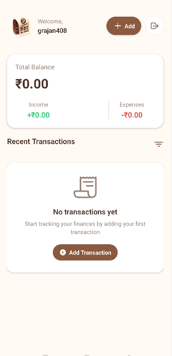
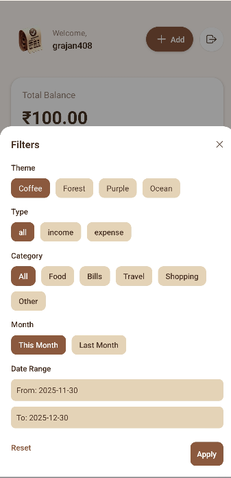
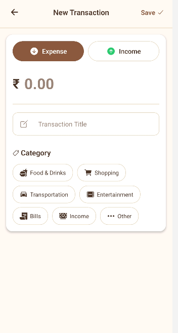
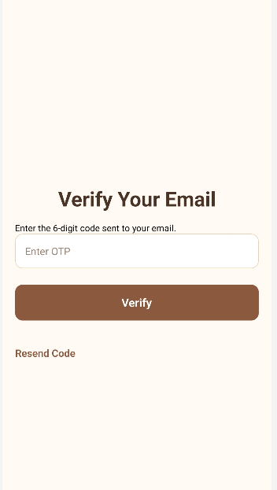
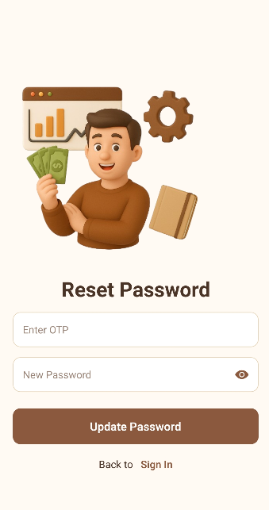

# 📱 Expense Tracker App

A modern personal finance tracker built using **React Native**, **Expo**, and **Clerk authentication**.
Track expenses, manage accounts, analyze trends, and enjoy a clean, fast mobile experience.

<p align="center">
  
</p>

---

## 🚀 Features

### 🔐 Authentication

* Email + Password Login
* OTP Verification
* Resend OTP
* Forgot Password
* Reset Password
* Secure session handling
* Auto-clears session when expired

### 💰 Transactions

* Add Credit/Debit transactions
* Categories selection
* Delete transactions
* Filter transactions

### 📊 Dashboard

* Monthly analytics
* Category-wise breakdown
* Real-time stats updating

### 🎨 UI & UX

* Multi color theme
* NativeWind styling
* Smooth animations
* Keyboard-aware forms
* Safe-area compatibility
* Eye toggle for password visibility

---

## 📸 Screenshots


| Dashboard                                         | Filter                                         | Add Transaction                             |
| ------------------------------------------------- | ---------------------------------------------------- | ------------------------------------------- |
|  |  |  |

| Sign In                                        | OTP Screen                                  | Reset Password                                |
| ---------------------------------------------- | ------------------------------------------- | --------------------------------------------- |
|  |  |  |

---

## 🔧 Installation

### 1️⃣ Clone the repo

```sh
git clone https://github.com/Rajan21252125/expense-tracker
cd expense-tracker
```

### 2️⃣ Install dependencies

```sh
npm install
```

### 3️⃣ Environment Variables

Create a `.env` file:

```
EXPO_PUBLIC_CLERK_PUBLISHABLE_KEY=your_key_here
```

### 4️⃣ Start the app

```sh
npx expo start
```

---

## 📦 Building an Android APK (EAS Build)

Install EAS CLI:

```sh
npm install -g eas-cli
```

Login:

```sh
eas login
```

Build APK:

```sh
eas build -p android --profile preview
```

Production APK:

```sh
eas build -p android --profile production
```

---

## 🔗 Backend Setup

This app connects to your backend API:

### Clone Backend Repo

```sh
git clone https://github.com/Rajan21252125/expense-tracker-backend
cd expense-tracker-backend
npm install
npm start
```

Your mobile app will communicate using:

```
EXPO_PUBLIC_API_URL=<your-backend-url>
```

---

## 🧱 Architecture Overview

```
React Native UI
   ↓
Expo Router Navigation
   ↓
Clerk Authentication
   ↓
Backend API (Node.js + Express)
```

---

## 🛠️ Tech Stack

| Category   | Technology                 |
| ---------- | -------------------------- |
| Mobile     | React Native (Expo SDK 54) |
| Navigation | Expo Router                |
| Auth       | Clerk                      |
| DB         | Postgre SQL                |
| Storage    | AsyncStorage               |
| Charts     | Recharts                   |
| Styling    | NativeWind                 |
| Backend    | Node + Express             |

---

## 🙋 Author

**Rajan Gupta**
GitHub: [https://github.com/Rajan21252125](https://github.com/Rajan21252125)

---

## ⭐ Want Enhancements?

Ask for:

* **Advanced README sections**
* **API documentation**
* **UX screenshots gallery**
* **Badges & project banner**
